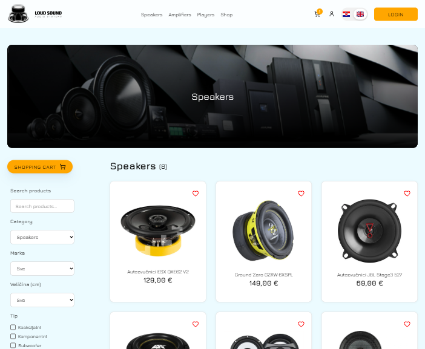

# Car Acoustics Webshop

A **full-stack, responsive, modern webshop** for car audio products built with **Next.js 15**, **TypeScript**, and **MongoDB**. The project features user authentication, internationalization, wishlist management, product ordering, payment integration, and an admin dashboard.

---

## Features

- **User Authentication** – secure login with JWT and cookies
- **Internationalization** – English and Croatian support
- **Wishlist Management** – add/remove products to a personal wishlist
- **Product Ordering & Checkout** – Stripe payment integration
- **Admin Dashboard** – manage users, products, orders, and analytics
- **Responsive Design** – works on desktop, tablet, and mobile

---

## Tech Stack

- **Frontend:** Next.js 15, TypeScript, React
- **Backend:** Next.js API routes
- **Database:** MongoDB
- **Authentication:** JWT
- **Payments:** Stripe
- **Styling:** CSS

---

## Screenshots

### Home Page

### Shop Page

### Product Page

